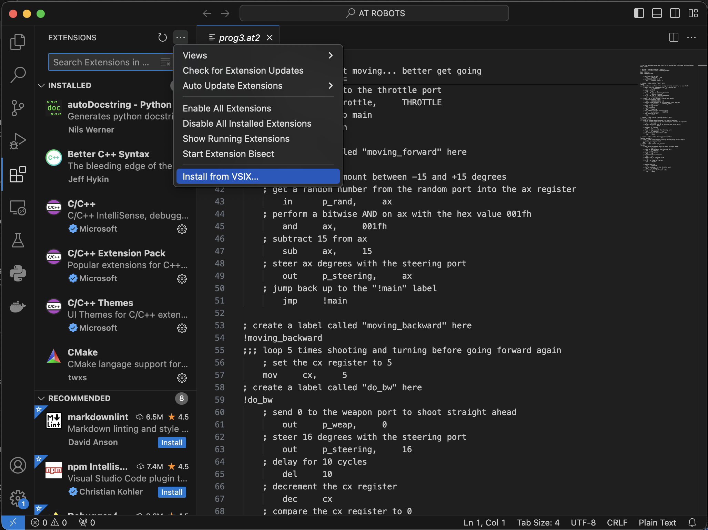
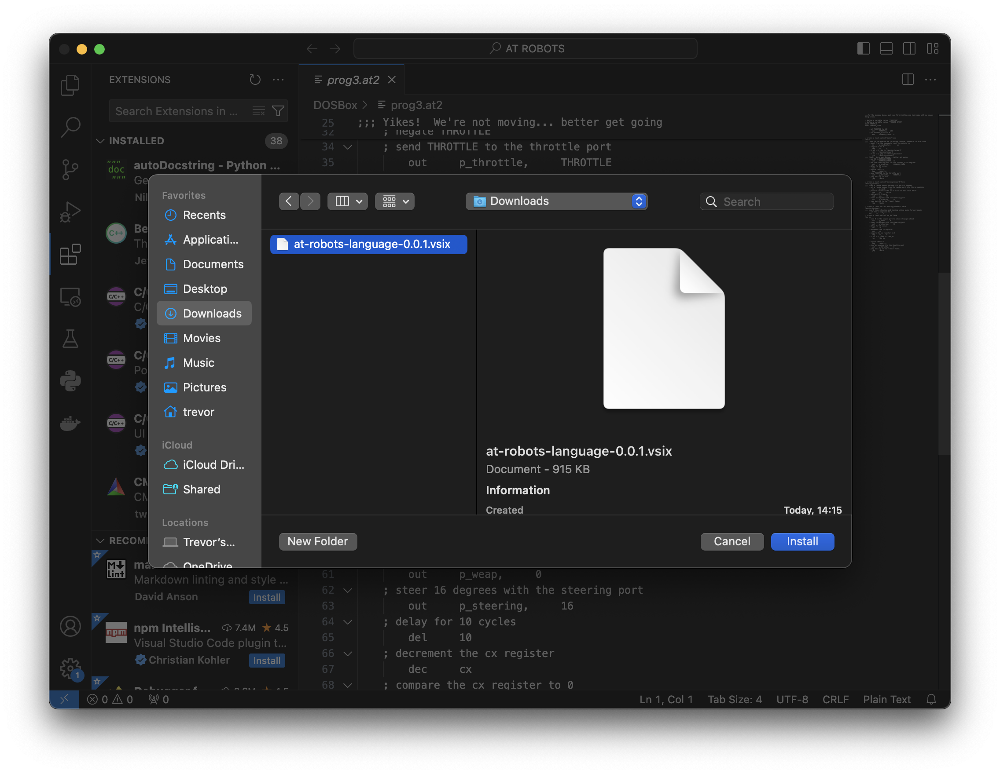
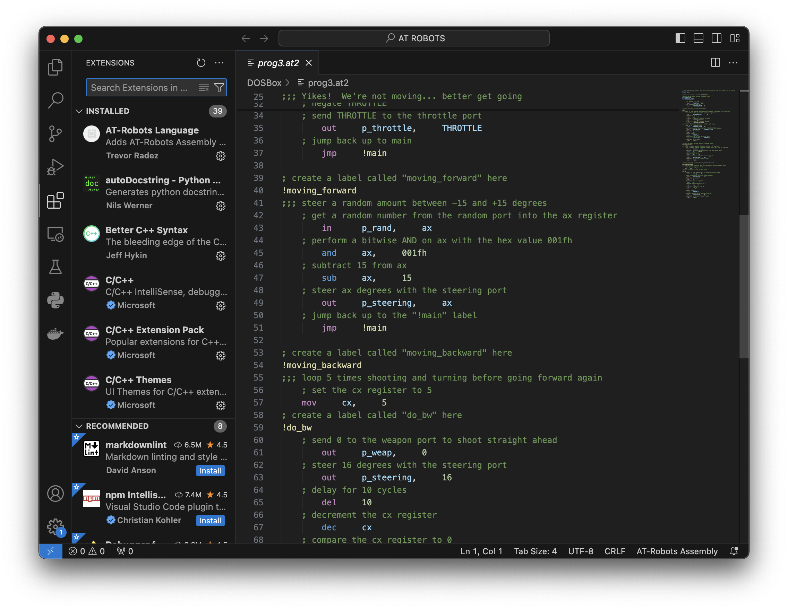

# SUNY Poly Undergrad Capstone - AT Robots Visual Studio Code Extension

Adds AT Robots assembly language support to AT-Robots and allows users to start AT-Robots through DosBOX-X from the VS Code editor.

## Folder Contents:
- *at-robots-language:* Language extension that adds support for the AT-Robots assembly language in VS Code
- *at-robrun:* Extension that runs AT-Robots through DOSBox-X. Refer to the README file inside of folder for more information.
- *at-robots-extension-pack:* Extension pack that combines both the language extension and the runner extension.

## Installation Instructions:
1. Download zip release and extract it
3. Go to Extensions >  the ```...``` button > Install from VSIX file. 
4. Select .vsix file. 
5. The extension is now installed! 

## Setup Instructions:
- Please consult the README.md file inside of each folder.