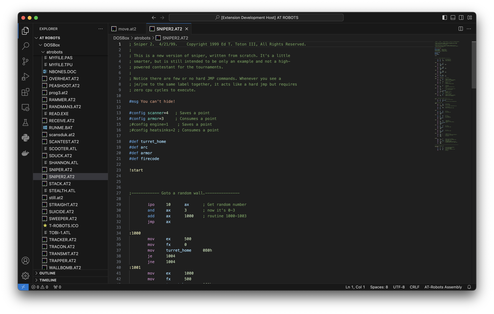

# at-robots-language README

This extension provides language support for the AT-Robots assembly language to Visual Studio Code. This includes full syntax highlighting and icons on AT-Robots assembly files.



## Installation Instructions
1. Clone repo
2. Copy this folder into ```~/.vscode/extensions/```, ```~``` represents your home directory.