# atrob-run README

This extension runs AT-Robots through DOSBox-X from Visual Studio Code. This extension combined with the language support extension provides a fully featured IDE for programming robots in AT-Robots assembly.

**This extension does not currently support Linux!**

## Features

- Set AT-Robots Location: Sets the location of the AT-Robots folder.
- Set DosBOX-X Location: Sets the location of the DOSBox-X executable/application. If no location is specified or this function is never run, the default installation location is used. (```C:\\dosbox-x\\dosbox-x.exe``` for windows and ```/Applications/dosbox-x.app``` on macOS).
 - Run AT-Robots: Runs AT-Robots and sets the location of DOSBox-X to the default locations above if the command was never run.

## Installation Instructions
1. Clone repo
2. Copy this folder into ```~/.vscode/extensions/```, ```~``` represents your home directory.

## Setup Instructions
### Set AT-Robots folder location
1. Copy the absolute path to the AT-Robots folder. This can look like ```C:\path\to\at\robots\folder``` or ```/path/to/at/robots/folder```
2. Click on the search bar on the top of the window and enter ```>AT-Robots: Set AT-Robots location``` 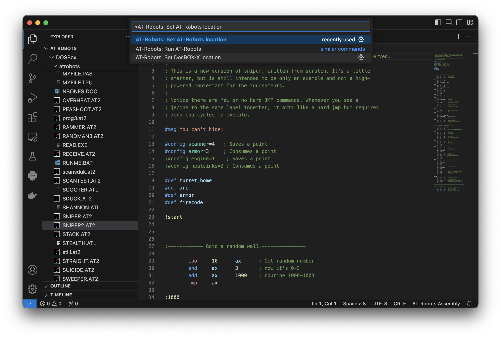
3. Press enter and paste the location into the text box. 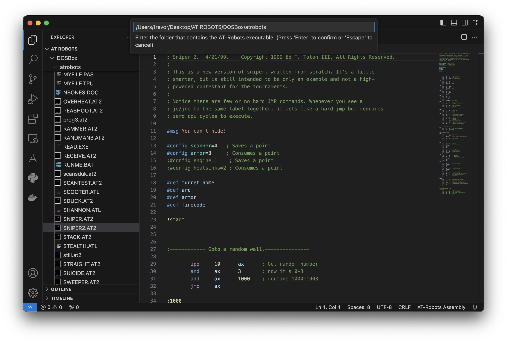
4. Press enter and you should get a message stating the location was set successfully set. 

### *Optional:* Set DOSBox-X location.
- If DOSBox-X is installed to the installation location, ```C:\\dosbox-x\\dosbox-x.exe``` on Windows and ```/Applications/dosbox-x.app``` on macOS, you do not need to perform this step.
1. Copy the absolute path to the DOSBox-X application/executable. This can look like ```C:\path\to\dosbox-x``` or ```/path/to/dosbox-x```
2. Click on the search bar on the top of the window and enter ```>AT-Robots: Set DOSBox-X location``` 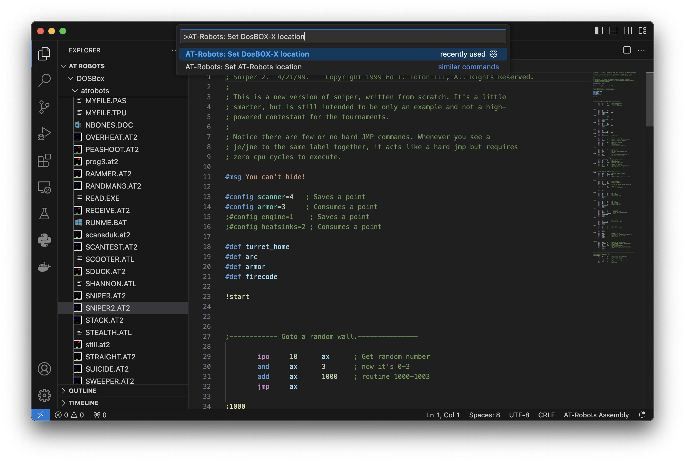
3. Press enter and paste the location into the text box. 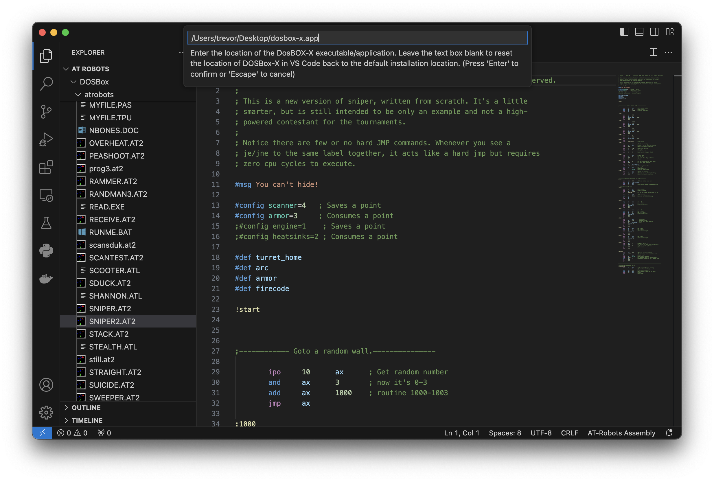
4. Press enter and you should get a message stating the location was successfully set. 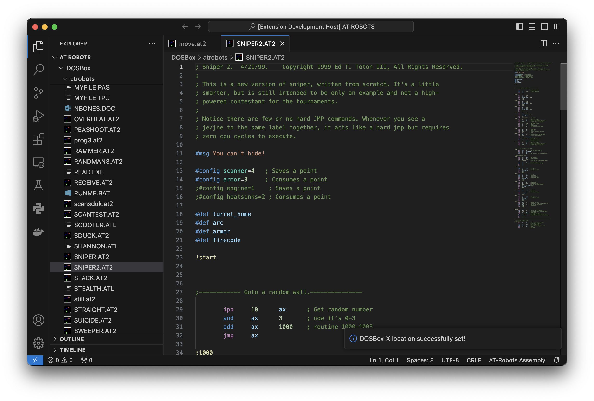
- *Note:* If you want to reset the DOSBox-X location in VS Code back to the default installtion location, perform the steps above except instead of pasting in the path to DOSBox-X, just leave the text box blank and press enter. You will get a message stating that the location has been reset.  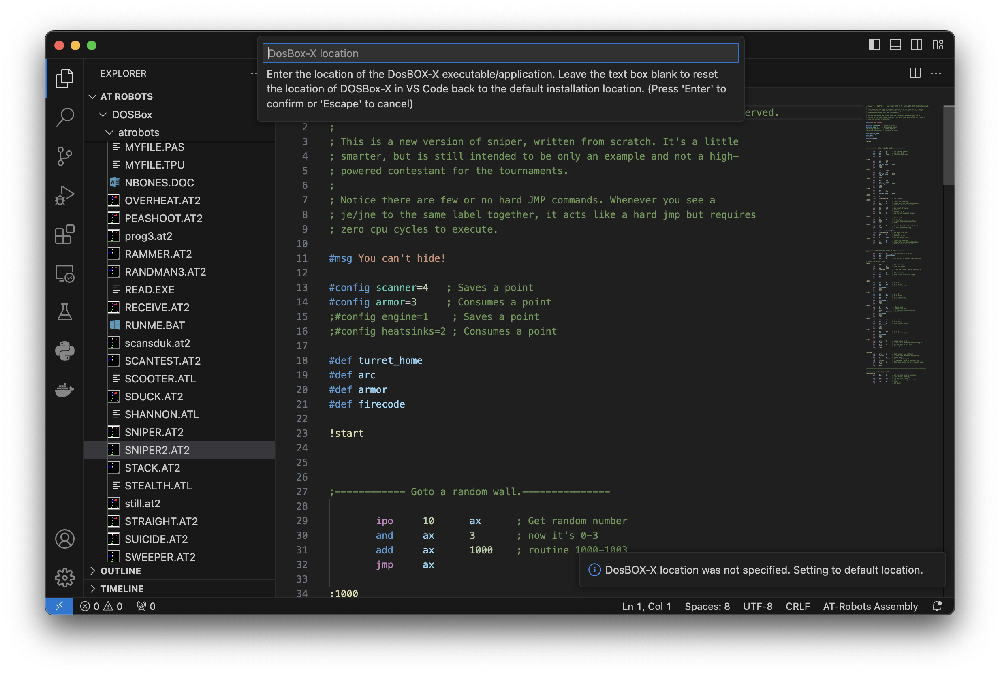 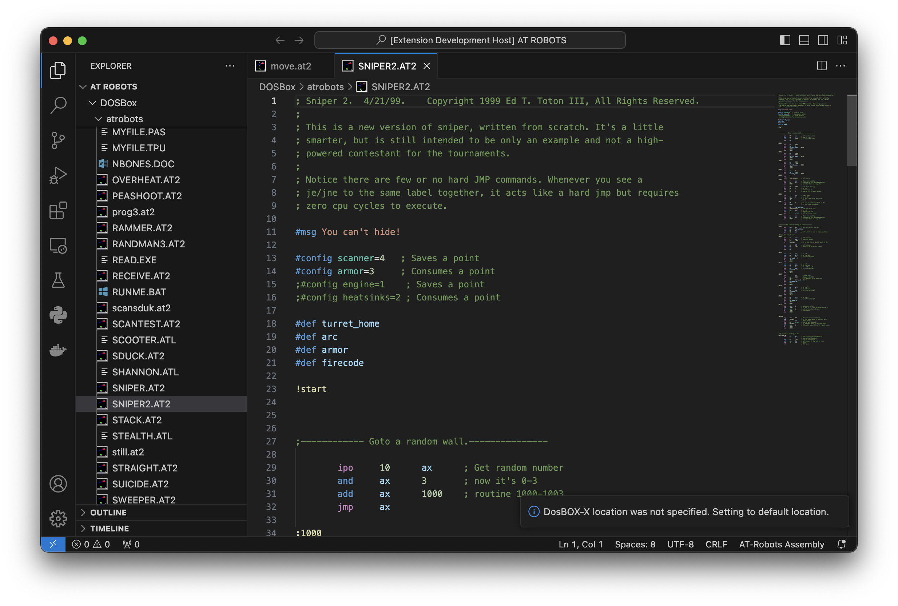

**Once setup is done on one machine, it never has to be done again unless the location of AT-Robots or DOSBox-X changes.**

## Running AT-Robots
1. Click on the search bar on the top of the window and enter ```>AT-Robots: Run AT-Robots``` 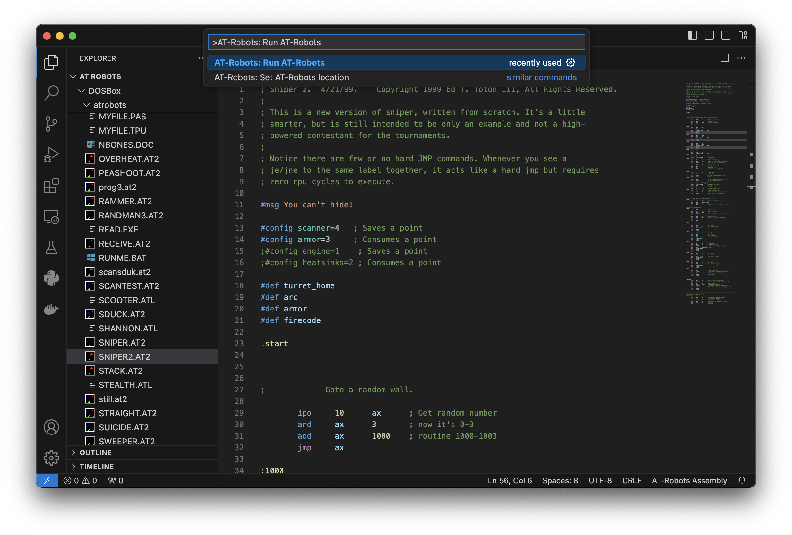
2. Press enter. You should get a message stating that AT-Robots is running through DOSBox-X. 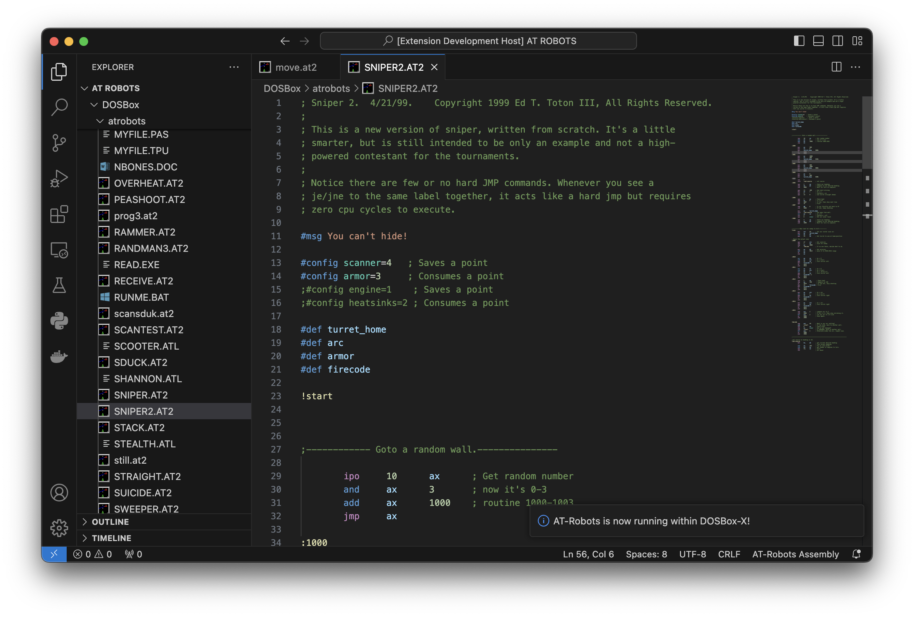
3. If you get a window asking you to select DOSBox-X's working directory, just use the default working directory and press choose. 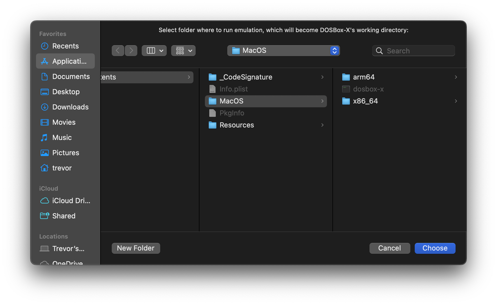
4. Congratulations! You have AT-Robots running on your system. Repeat these steps if you would like to run AT-Robots again. 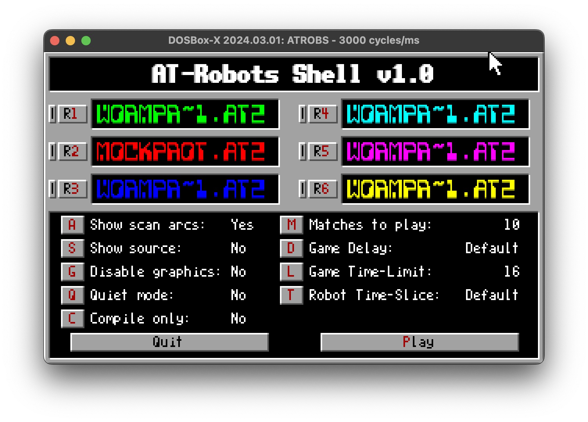

- **Note:** You might want to change the CPU emulation speed in DOSBox-X. To do this, go to the menu bar and select CPU > Emulate CPU Speed > 486DX4 100MHz. This is the CPU that I reccommend emulating. If it is too fast or too slow, you can slect a faster or slower CPU and change the CPU speed in the CPU menu.